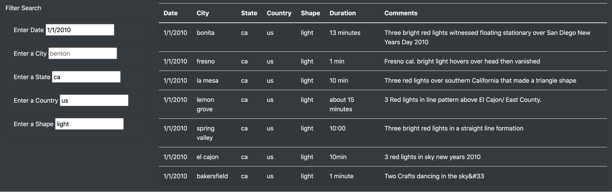

# Overview

In this project, an HTML page is built to display all recorded UFO sightings in the US in the first few days of year 2010. Using javascript, capability is provided to filter this information based upon:
* A specific date
* City
* State
* County
* Shape of the UFO object

# Results

The search functionality is provided using input text boxes. An event listener fires every time the user enters data in the search box **and clicks somewhere or presses the enter button**. An example search and the corresponding result is demonstrated in the picture below.

The search is done using the following criteria:

* Date: 1/1/2010
* State: ca
* County: us
* Shape: light
